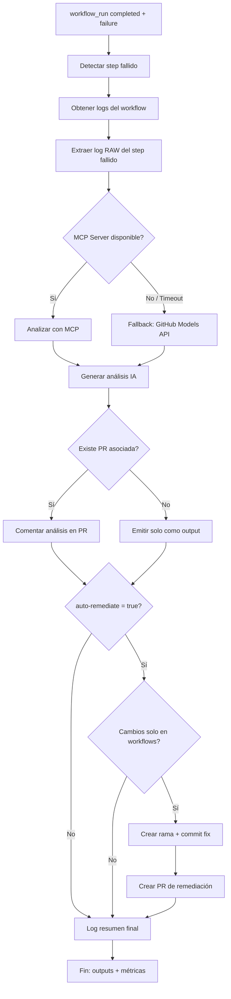
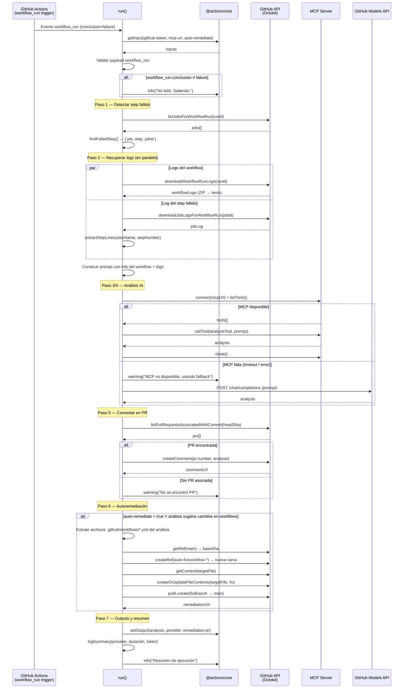

# AI Workflow Failure Analyzer

GitHub Action que analiza automáticamente workflows fallidos  usando IA (MCP Server / Copilot fallback) y sugiere soluciones.

## Flujo





## Inputs

| Input            | Requerido | Default                 | Descripción                                                                |
| ---------------- | --------- | ----------------------- | -------------------------------------------------------------------------- |
| `github-token`   | Sí        | —                       | Token con permisos `actions:read`, `contents:write`, `pull-requests:write` |
| `mcp-url`        | No        | `http://localhost:3000` | URL del GitHub MCP Server                                                  |
| `copilot-token`  | No        | `''`                    | **[OBSOLETO]** Ya no es necesario. El fallback usa `github-token`          |
| `auto-remediate` | No        | `false`                 | Habilitar auto-corrección de workflows                                     |

## Outputs

| Output           | Descripción                                |
| ---------------- | ------------------------------------------ |
| `analysis`       | Texto del análisis generado por IA         |
| `provider`       | `mcp` o `copilot` según el proveedor usado |
| `remediation-pr` | URL del PR de auto-remediación (si aplica) |

## Uso rápido

```yaml
on:
  workflow_run:
    workflows: ["CI", "Deploy"]
    types: [completed]

jobs:
  analyze:
    if: ${{ github.event.workflow_run.conclusion == 'failure' }}
    runs-on: ubuntu-latest
    permissions:
      actions: read
      contents: write
      pull-requests: write
    steps:
      - uses: actions/checkout@v4
      - uses: ./workflow-failure-analyzer
        with:
          github-token: ${{ secrets.GITHUB_TOKEN }} # Usa GITHUB_TOKEN, no PAT
          mcp-url: ${{ secrets.MCP_URL }} # Opcional
          auto-remediate: "true" # Opcional
```

## Seguridad

- Tokens nunca se loguean completos (máscara `xxxx...xxxx`)
- `auto-remediate` solo modifica archivos en `.github/workflows/*.yml`
- Valida que los cambios sugeridos sean exclusivamente de workflow antes de commitear
- Usa `fine-grained PAT` con scopes mínimos necesarios

## Costes

| Proveedor         | Coste                                              |
| ----------------- | -------------------------------------------------- |
| MCP (GitHub)      | $0 (incluido con GitHub MCP Server)                |
| GitHub Models API | $0 (incluido con GitHub Actions, sujeto a límites) |

## Arquitectura

```
IA-actions/
├── workflow-failure-analyzer/   # Este action
│   ├── action.yml
│   ├── package.json
│   ├── dist/              # Bundle autocontenido (ncc)
│   │   └── index.js
│   ├── src/
│   │   └── index.js
│   └── docs/
│       └── README.md
├── .github/workflows/
│   └── analyze-failure.yml      # Workflow (raíz del repo)
└── otro-action/                 # Futuras actions
```

## Desarrollo

```bash
cd workflow-failure-analyzer
npm install           # Instalar dependencias (solo desarrollo)
npm run build         # Generar dist/index.js (commitear el resultado)
```

> **Importante:** Ejecutar `npm run build` y commitear `dist/` tras cada cambio en `src/`.
> El action usa `dist/index.js` directamente — los consumidores no necesitan `npm ci`.

## Requisitos del token

Para consultas cross-repo con MCP, usar un **fine-grained PAT** con:

- `actions:read` en los repos objetivo
- `contents:read+write` (si auto-remediate)
- `pull-requests:write` para comentar
- Scope de organización si se necesita acceso multi-repo
